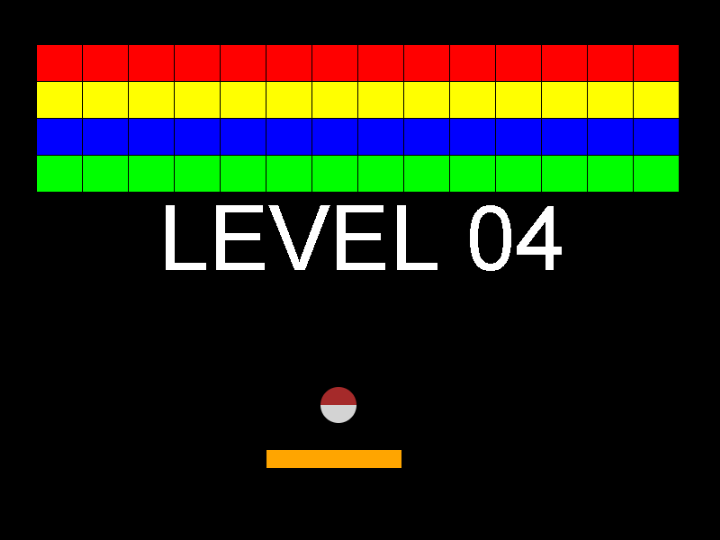

# Arkanoid

Uma versão minimalista e moderna do clássico jogo **Arkanoid** desenvolvida em **HTML5 e JavaScript Puro (ES6)**. 

Este projeto foi reestruturado com foco pedagógico para servir de introdução à lógica de programação de jogos e à Programação Orientada a Objetos (POO) para alunos iniciantes, oferecendo um paralelo direto com os conceitos usados em C# com XNA/MonoGame.



---

## 🎮 Como Jogar / Controles

* **Mover Raquete:** Use as setas `Esquerda` (←) e `Direita` (→) do teclado.
* **Pausar/Retomar:** Pressione a tecla `P` durante a partida.

---

## 🚀 Como Executar o Projeto

Como o projeto utiliza **módulos nativos do JavaScript (ES6)** para manter o código limpo e organizado, os navegadores modernos bloqueiam o carregamento direto por motivos de segurança se você apenas der dois cliques no arquivo `index.html` (protocolo `file://`).

Para rodar o jogo localmente, você precisa usar um servidor local. Aqui estão as formas mais fáceis de fazer isso:

### Opção 1: VS Code (Recomendado para alunos)
1. Instale a extensão **Live Server** (por Ritwick Dey) no VS Code.
2. Abra a pasta do projeto no VS Code: `File > Open Folder`.
3. Abra o arquivo `index.html` e clique no botão **"Go Live"** no canto inferior direito da tela.

### Opção 2: Python (Terminal)
Abra o terminal na pasta do projeto e digite o comando correspondente à sua versão do Python:
```bash
python -m http.server 8000
# ou para Python 2: python -m SimpleHTTPServer 8000
```
Em seguida, abra o navegador e acesse: `http://localhost:8000`.

### Opção 3: NodeJS
Se você tiver o Node.js instalado, pode rodar o servidor direto no terminal usando:
```bash
npx http-server
```

---

## 🎓 Conceitos Didáticos Abordados no Código

Este repositório foi construído para servir de base em sala de aula, ensinando os seguintes fundamentos de desenvolvimento de jogos:

1. **Game Loop com `requestAnimationFrame`:** 
   O ciclo contínuo de atualização (`update`) e desenho (`draw`) sincronizado com a taxa de atualização do monitor do jogador, garantindo alta fluidez.
2. **Programação Orientada a Objetos (POO):**
   * **Classes Base (Modelos/Abstratas):** [`GameObject`](./src/js/gameObject.js) (para entidades físicas) e [`Scene`](./src/js/scene.js) (para as fases e telas).
   * **Herança com `extends` e `super()`:** Como as entidades (`Player`, `Ball`, `Rect`) herdam propriedades físicas comuns (x, y, largura, altura) da classe base.
3. **Gerenciamento de Estados de Entrada (Input Polling):**
   Uso do objeto [`input.js`](./src/js/input.js) para rastrear teclas pressionadas de maneira similar ao `Keyboard.GetState()` do XNA, ensinando também a diferença entre detectar uma tecla "segurada" (`isKeyDown`) e um "toque único" (`isKeyJustPressed` - usado no Pause).
4. **Detecção de Colisão AABB (Axis-Aligned Bounding Box):**
   Fórmula matemática em 2D para checar sobreposição de retângulos/caixas de colisão entre a bola, raquete e blocos, com tratamento de resposta física (inversão de vetor de velocidade).
5. **Máquina de Estados Simples para Cenas:**
   Como o [`sceneManager.js`](./src/js/sceneManager.js) controla a transição fluida entre o menu inicial, a cena de jogo, tela de game over e tela de vitória.
6. **Integração com API Externa (Facebook SDK):**
   Demonstração prática de como receber e renderizar imagens dinâmicas vindas de APIs de redes sociais diretamente no Canvas do jogo.

---

## 📁 Estrutura de Pastas

```text
├── index.html                 # Página inicial e ponto de partida do DOM / SDK do FB
├── screenshotlevel04.png      # Imagem ilustrativa do jogo
├── LICENSE                    # Licença do repositório
└── src/
    └── js/
        ├── main.js            # Ponto de entrada (Bootstrap) e inicializador do Loop
        ├── graphics.js        # Wrapper simples do contexto 2D do Canvas
        ├── input.js           # Gerenciador de eventos de teclado e mouse
        ├── gameObject.js      # Classe base para objetos de jogo (física/posição)
        ├── player.js          # Entidade da raquete do jogador (herda de GameObject)
        ├── ball.js            # Entidade da bola (herda de GameObject)
        ├── rect.js            # Entidade do bloco individual (herda de GameObject)
        ├── rectManager.js     # Classe que gera e gerencia a grade de blocos
        ├── scene.js           # Classe base para definição de telas/cenas
        ├── sceneManager.js    # Gerenciador e máquina de estados das cenas
        ├── opening.js         # Cena do menu inicial (herda de Scene)
        ├── game.js            # Cena principal da partida (herda de Scene)
        ├── congratulations.js # Cena de vitória (herda de Scene)
        ├── gameOver.js        # Cena de derrota (herda de Scene)
        └── collisionManager.js# Gerenciador das regras físicas e colisões do jogo
```
